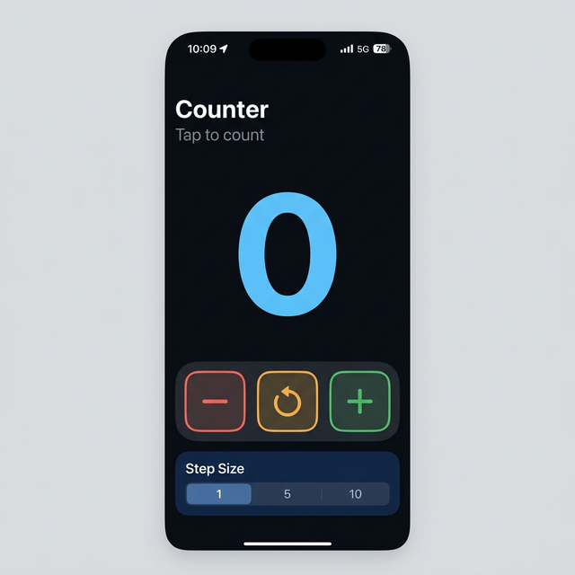
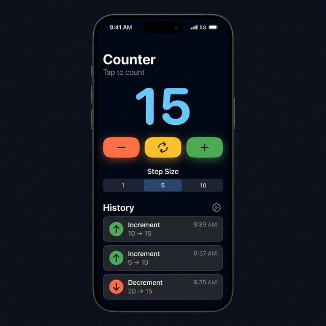

# CountUp — iOS Counter App

A clean, production-ready iOS counter app built with **SwiftUI** and the **MVVM** architecture pattern. Designed as a portfolio piece demonstrating modern iOS development best practices.

---

## Screenshots

<p align="center">
  
  &nbsp;&nbsp;&nbsp;&nbsp;
  
</p>

---

## Features

- **Increment / Decrement / Reset** — Large, accessible action buttons with haptic feedback
- **Configurable Step Size** — Choose between step sizes of 1, 5, or 10 via a segmented picker
- **Action History Log** — Tracks the last 10 actions with timestamps, color-coded icons, and before/after values
- **Smooth Animations** — Numeric text transitions and fade-in history entries
- **Dark Mode UI** — Custom HSL-based color palette for a sleek, modern look
- **Accessibility** — VoiceOver labels and identifiers on all interactive elements

---

## Architecture

```
practice/
├── practiceApp.swift              # App entry point (CountUpApp)
├── Models/
│   ├── Counter.swift              # Counter value type with business logic
│   └── HistoryEntry.swift         # Identifiable history record model
├── ViewModels/
│   └── CounterViewModel.swift     # ObservableObject managing state & history
├── Views/
│   ├── CounterView.swift          # Main screen composing all sections
│   └── Components/
│       ├── CounterButton.swift    # Reusable action button component
│       └── HistoryRowView.swift   # Single history entry row component
└── Extensions/
    └── Color+Theme.swift          # Centralized design system colors
```

### Design Pattern: MVVM

| Layer         | Responsibility                          |
|---------------|-----------------------------------------|
| **Model**     | `Counter` — encapsulates value + mutations (non-negative constraint) |
| **Model**     | `HistoryEntry` — immutable record of a counter action |
| **ViewModel** | `CounterViewModel` — manages published state, records history |
| **View**      | `CounterView` — composes UI sections, binds to ViewModel |
| **Component** | `CounterButton`, `HistoryRowView` — reusable, stateless UI pieces |

---

## Tech Stack

| Technology | Version |
|------------|---------|
| Swift      | 5.0+    |
| SwiftUI    | 5.0+    |
| Xcode      | 26.2+   |
| iOS Target | 26.2+   |

---

## Getting Started

1. **Clone** the repository:
   ```bash
   git clone https://github.com/abdullahbokl/practice.git
   ```
2. **Open** `practice.xcodeproj` in Xcode
3. **Select** an iPhone simulator (iPhone 16 recommended)
4. **Run** the app with `⌘R`

---

## Key Concepts Demonstrated

- **MVVM Architecture** — Clean separation of concerns between data, logic, and presentation
- **Value Types** — `Counter` is a `struct` with `mutating` methods keeping business rules at the model level
- **Published State** — `@Published` + `@StateObject` for reactive UI updates
- **Reusable Components** — `CounterButton` and `HistoryRowView` are stateless, configurable views
- **Accessibility** — `accessibilityLabel` and `accessibilityIdentifier` on all interactive elements
- **Design System** — Centralized `Color` extension for consistent theming
- **Haptic Feedback** — `sensoryFeedback` modifier for tactile button responses
- **Animations** — `contentTransition(.numericText)` and `.transition(.opacity)` for fluid UX

---

## License

This project is available for personal and educational use.
